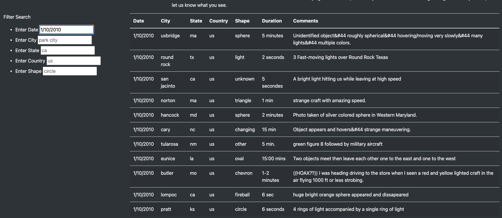
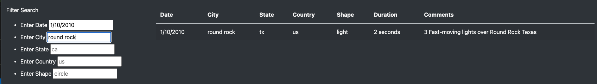
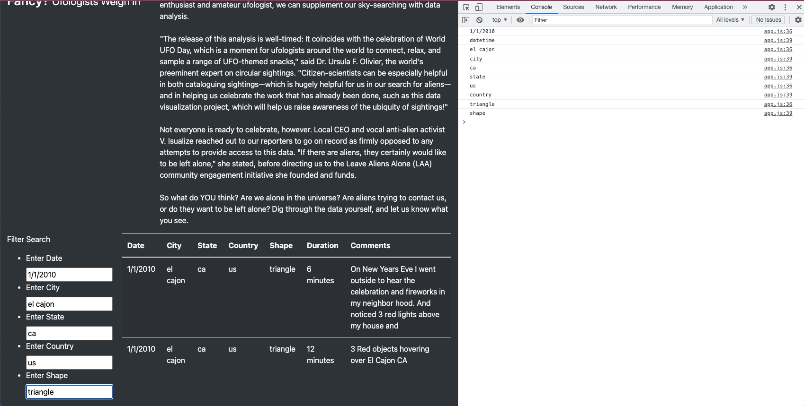

# UFOs

## Overview of the analysis

We created a webpage with HTML and Javascript that contained data on reported UFO sightings. We designed a search box where users can enter the date to narrow down the UFO sightings from that day. Dana, the client, wanted to expand that search box to filter for multiple different criteria at the same time. We created table filters for the date, city, state, country and shape using Javascript.

## Results:
We were able to create a search function that runs every time you hit "enter" on your keyboard after entering text in for one or more of the searcg different criteria. 

#### A user may come in and only want to see search results from one particular day. They would type in the date and hit "enter" for only matching date results to pop up. Example below:

#### If a user wanted to narrow the search further, they would enter in another search criteria box and hit "enter" for updated results. An example of both date and city name is below.

#### Each time a user enters search criteria, Javascript records the search item in the DevTools console and matches the text with the correct "id" html element to produce the results. Example below:

## Summary
In conclusion, users would be able to search for results by one or more criteria options. One drawback of this webpage is it is case sensitive, meaning if a user types their search critiera with capitolization, it will not spit out the results since the data does not contain capital letters.

I would recommend editing the Javascript to allow for any type of capitolization to pass, and only match the characters to solve for the issue I addressed above. I would also recommend adding back in the button element, instead of only pressing "enter" to get the search results. That way it's obvious to the user when they are searching instead of hitting enter every time a new search criteria is filled. 
